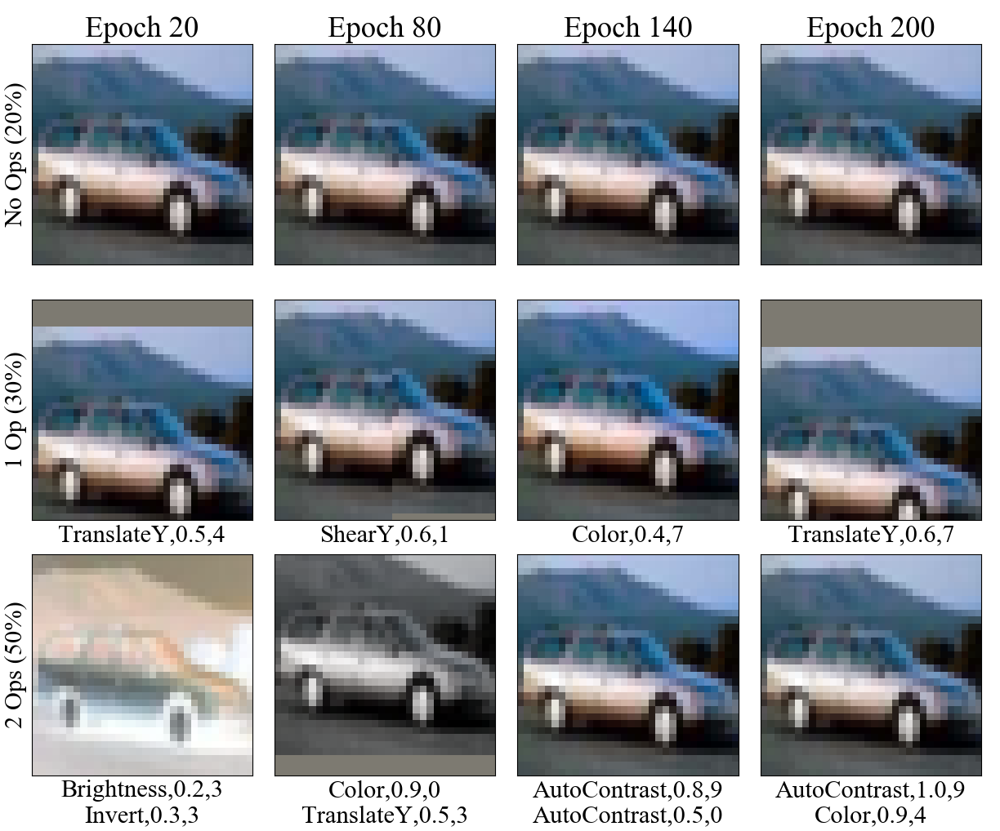
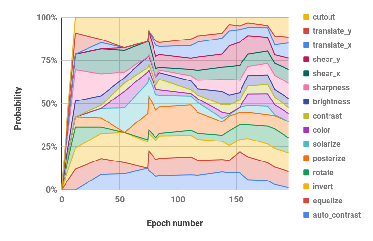
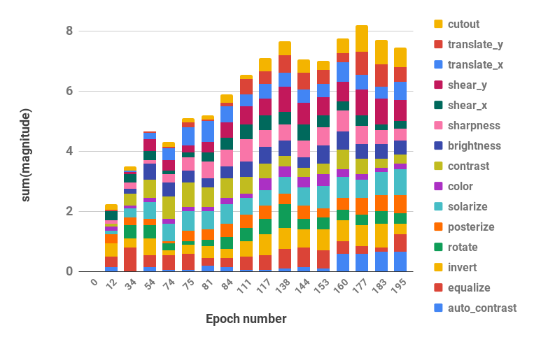

# Population Based Augmentation (PBA)

<b><i>New: Visualize PBA and applied augmentations with the notebook `pba.ipynb`!</b></i>

<b><i>Now with Python 3 support.</b></i>

### Table of Contents

1. [Introduction](#introduction)
2. [Getting Started](#getting-started)
3. [Reproduce Results](#reproduce-results)
4. [Run PBA Search](#run-pba-search)
5. [Citation](#citation)

### Introduction

Population Based Augmentation (PBA) is a algorithm that quickly and efficiently learns data augmentation functions for neural network training. PBA matches state-of-the-art results on CIFAR with one thousand times less compute, enabling researchers and practitioners to effectively learn new augmentation policies using a single workstation GPU.

This repository contains code for the work "Population Based Augmentation: Efficient Learning of Augmentation Schedules" (http://arxiv.org/abs/1905.05393) in TensorFlow and Python. It includes training of models with the reported augmentation schedules and discovery of new augmentation policy schedules.

See below for a visualization of our augmentation strategy.

<p align="center">

</p>

### Getting Started
Code supports Python 2 and 3.

####  Install requirements

```shell
pip install -r requirements.txt
```

#### Download CIFAR-10/CIFAR-100 datasets

```shell
bash datasets/cifar10.sh
bash datasets/cifar100.sh
```

### Reproduce Results

<div class="tg-wrap"><table>
  <tr>
    <th>Dataset</th>
    <th>Model</th>
    <th>Test Error (%)</th>
  </tr>
  <tr>
    <td rowspan="5">CIFAR-10</td>
    <td>Wide-ResNet-28-10</td>
    <td>2.58</td>
  </tr>
  <tr>
    <td>Shake-Shake (26 2x32d)</td>
    <td>2.54</td>
  </tr>
  <tr>
    <td>Shake-Shake (26 2x96d)</td>
    <td>2.03<br></td>
  </tr>
  <tr>
    <td>Shake-Shake (26 2x112d)</td>
    <td>2.03</td>
  </tr>
  <tr>
    <td>PyramidNet+ShakeDrop</td>
    <td>1.46</td>
  </tr>
  <tr>
    <td rowspan="2">Reduced CIFAR-10</td>
    <td>Wide-ResNet-28-10</td>
    <td>12.82</td>
  </tr>
  <tr>
    <td>Shake-Shake (26 2x96d)</td>
    <td>10.64</td>
  </tr>
  <tr>
    <td rowspan="3">CIFAR-100</td>
    <td>Wide-ResNet-28-10</td>
    <td>16.73</td>
  </tr>
  <tr>
    <td>Shake-Shake (26 2x96d)</td>
    <td>15.31</td>
  </tr>
  <tr>
    <td>PyramidNet+ShakeDrop</td>
    <td>10.94</td>
  </tr>
  <tr>
    <td rowspan="2">SVHN</td>
    <td>Wide-ResNet-28-10</td>
    <td>1.18</td>
  </tr>
  <tr>
    <td>Shake-Shake (26 2x96d)</td>
    <td>1.13</td>
  </tr>
  <tr>
    <td rowspan="2">Reduced SVHN</td>
    <td>Wide-ResNet-28-10</td>
    <td>7.83</td>
  </tr>
  <tr>
    <td>Shake-Shake (26 2x96d)</td>
    <td>6.46</td>
  </tr>
</table></div>

Scripts to reproduce results are located in `scripts/table_*.sh`. One argument, the model name, is required for all of the scripts. The available options are those reported for each dataset in Table 2 of the paper, among the choices: `wrn_28_10, ss_32, ss_96, ss_112, pyramid_net`. Hyperparamaters are also located inside each script file.

For example, to reproduce CIFAR-10 results on Wide-ResNet-28-10:

```shell
bash scripts/table_1_cifar10.sh wrn_28_10
```

To reproduce Reduced SVHN results on Shake-Shake (26 2x96d):

```shell
bash scripts/table_4_svhn.sh rsvhn_ss_96
```

A good place to start is Reduced SVHN on Wide-ResNet-28-10 which can complete in under 10 minutes on a Titan XP GPU reaching 91%+ test accuracy.

Running the larger models on 1800 epochs may require multiple days of training. For example, CIFAR-10 PyramidNet+ShakeDrop takes around 9 days on a Tesla V100 GPU.

### Run PBA Search

Run PBA search on Wide-ResNet-40-2 with the file `scripts/search.sh`. One argument, the dataset name, is required. Choices are `rsvhn` or `rcifar10`.

A partial GPU size is specified to launch multiple trials on the same GPU. Reduced SVHN takes around an hour on a Titan XP GPU, and Reduced CIFAR-10 takes around 5 hours.

```shell
CUDA_VISIBLE_DEVICES=0 bash scripts/search.sh rsvhn
```

The resulting schedules used in search can be retreived from the Ray result directory, and the log files can be converted into policy schedules with the `parse_log()` function in `pba/utils.py`. For example, policy schedule learned on Reduced CIFAR-10 over 200 epochs is split into probability and magnitude hyperparameter values (the two values for each augmentation operation are merged) and visualized below:

Probability Hyperparameters over Time     |         Magnitude Hyperparameters over Time
:-------------------------:|:-------------------------:
  |  

### Citation
If you use PBA in your research, please cite:

```
@inproceedings{ho2019pba,
  title     = {Population Based Augmentation: Efficient Learning of Augmentation Policy Schedules},
  author    = {Daniel Ho and
               Eric Liang and
               Ion Stoica and
               Pieter Abbeel and
               Xi Chen
  },
  booktitle = {ICML},
  year      = {2019}
}
```
